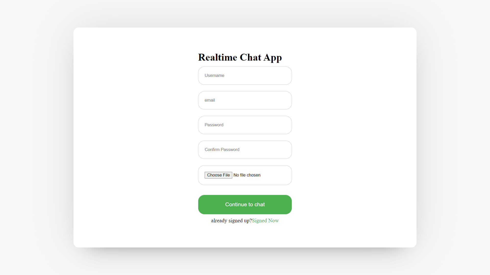

# watsap-clone-lates-master-latesst

This is a dynamic chatting website built using PHP and Ajax technology. 

With Ajax, users can send and receive chat messages asynchronously, with no need for page refreshes. 

To ensure security, user passwords are stored in hashed form. 

Users can easily register and login to start chatting with other users that they have added. 
The chat messages are saved in a database, and users can view their conversations in almost in real-time as they happen.

