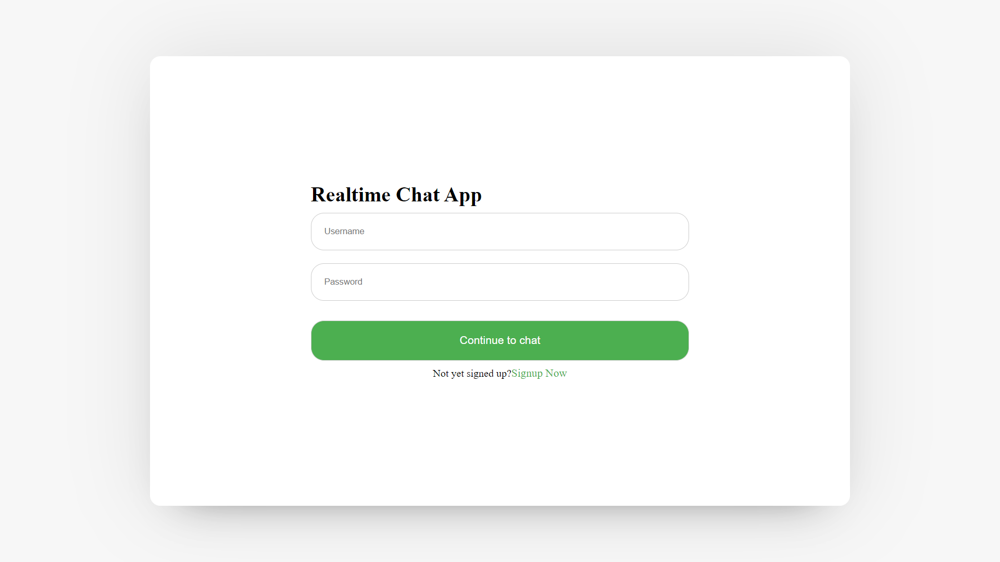

https://immane-adjustments.000webhostapp.com/login.php
(The links show decepltive site) ( only way to open is disable browser protection)
# Chat-Web-App

This is a dynamic chatting website built using PHP and Ajax technology. 

With Ajax, users can send and receive chat messages asynchronously, with no need for page refreshes. 

To ensure security, user passwords are stored in hashed form. 

Users can easily register and login to start chatting with other users that they have added. 
The chat messages are saved in a database, and users can view their conversations in almost in real-time as they happen.

old one =>

# <VirtualHost *:80>
#     ServerName local.chatting-webApp 
#     DocumentRoot "C:/xampp/htdocs/Chatting-WebApp"
#     <Directory "C:/xampp/htdocs/Chatting-WebApp"> 
#         Options Indexes FollowSymLinks MultiViews
#         AllowOverride all
#         Order Deny,Allow
#         Allow from all
#         Require all granted
#     </Directory>
# </VirtualHost>

C:\xampp\apache\conf\extra\httpd-vhosts.conf

<VirtualHost *:80>
    ServerName local.chatting-webapp
    DocumentRoot "C:/xampp/htdocs/Chatting-WebApp"

    <Directory "C:/xampp/htdocs/Chatting-WebApp"> 
        Options Indexes FollowSymLinks MultiViews
        AllowOverride All
        Order Deny,Allow
        Allow from all
        Require all granted
    </Directory>

    # Proxy WebSocket connections
    ProxyRequests Off
    ProxyPass /ws ws://localhost:8080/
    ProxyPassReverse /ws ws://localhost:8080/

    ErrorLog "logs/local.chatting-webapp-error.log"
    CustomLog "logs/local.chatting-webapp-access.log" common
</VirtualHost>

